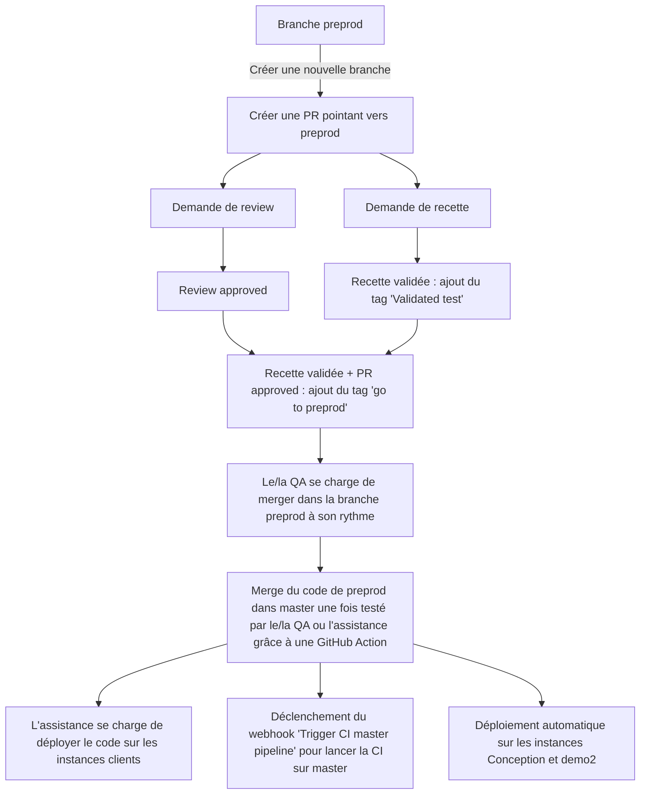
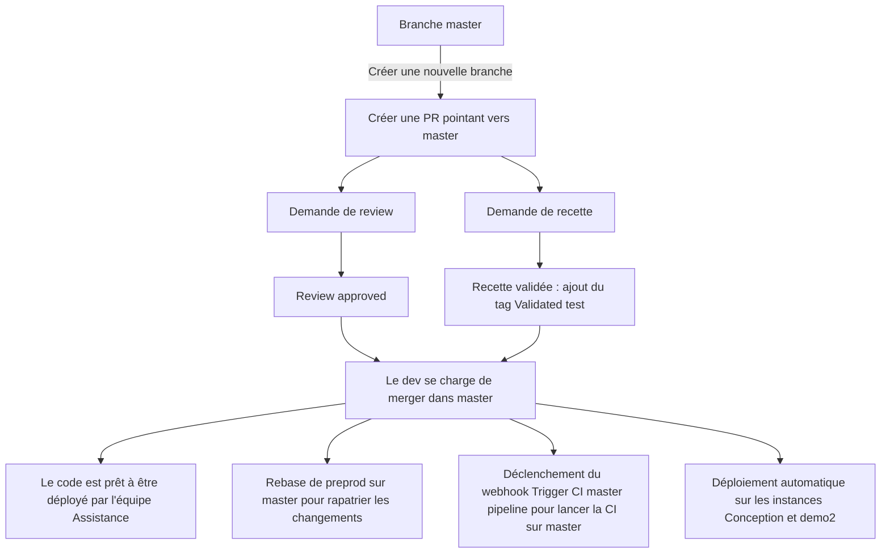
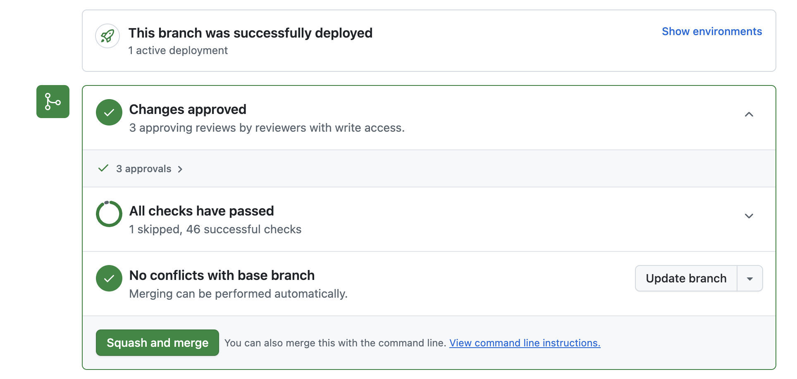
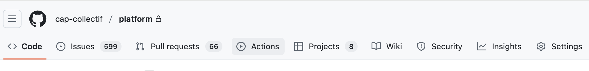
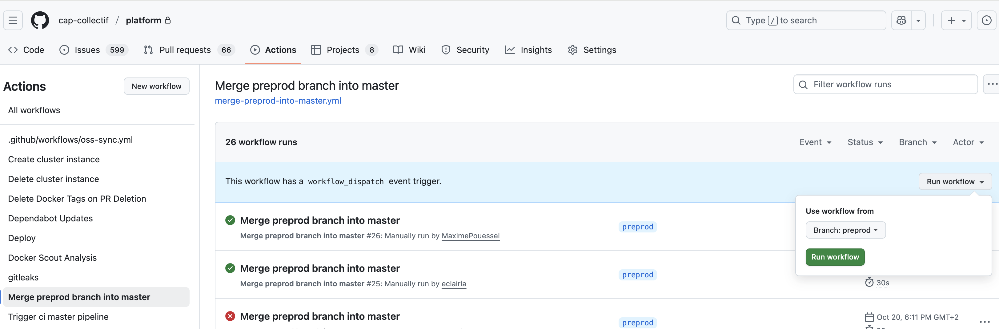

# Mise en place d'une branche `preprod`

## Historique

Avant d'avoir une branche `preprod` et une branche `master` distinctes
la branche `master` avait à la fois pour rôle d'être la branche de référence pour déployer le code sur les instances clients
et à la fois le rôle de déployer ce même code sur l'instance de `preprod`.

Le code sur `master` était testé par le/la QA sur l'instance preprod.

Cette architecture posait 2 problèmes concrets :

- du code non testé pouvait se retrouver en production à cause d'un bug bloquant nécessitant une mise en
  production rapidement.
- un bouchon pouvait se créer naturellement sur la preprod étant donné que l'on pouvait merger dans `master`
dès qu'une fonctionnalité était validée, bloquant ainsi les déploiements.

## Mise en place d'une branche preprod

La branche `preprod` a vocation à répondre à cette problématique en distinguant bien les rôles de la branche `preprod` de ceux de la branche `master`.

La branche `preprod` a pour rôle d'être une branche de test / validation avant la mise en production.

La branche `master` a pour rôle de contenir du code testé prêt à être déployé par l'équipe Assistance.

La branche de référence du projet devient `preprod`.

Toutes les nouvelles branches doivent être tirées de `preprod` et toutes les PRs doivent pointer vers `preprod`.

### Cycle de vie d'une PR

#### Dans le cas d'une nouvelle feature / tâche technique  



Dans le cas d'une tâche technique ne nécessitant pas de recette et ayant été approuvée, nous pouvons directement merger la PR dans preprod si la ci passe.

#### Dans le cas d'un bug bloquant

Les bugs bloquants ont besoin d'être déployés rapidement de par leur nature.

Pour éviter qu'ils n'aient à se retrouver bloqués dans les tests de la branche `preprod`, le process change :



Commandes à lancer pour rappatrier le code de master sur preprod et conserver un historique linéaire sur preprod :

```
git branch -D master && git fetch origin master && git checkout master
git branch -D preprod && git fetch origin preprod && git checkout preprod
git rebase master
git push --force-with-lease
```

Seules certaines personnes peuvent forcer le push sur preprod. Cette liste peut être étendue au cas par cas.

### Comment déployer ?

- Aller sur les PRs ayant le label [Go to preprod](https://github.com/cap-collectif/platform/pulls?q=is%3Aopen+is%3Apr+label%3A%22Go+to+preprod%22)
- Merger la PR ayant le label en cliquant sur le bouton "Squash and merge"



- une fois mergé, aller sur la branche preprod et vérifier qu'une ci tourne bien sur la branche


- une fois la recette validée, il faut activer le github action pour merger le code de preprod dans master en allant dans l'onglet `Actions`



- Cliquer sur `Merge preprod branch into master` dans le menu à gauche de la page puis cliquer sur `Run workflow` à droite de la page et `Run workflow`.

La branche sélectionnée doit être `preprod` (branche par défaut).

Si le job est vert alors le merge a fonctionné. Dans le cas contraire une intervention manuelle est nécessaire pour débugger le soucis.



### Résolutions :

Ce nouveau process permet :

- de s'assurer que le code déployé sur les instances clients est du code testé
- d'éviter de bloquer des déploiements à cause de code non testé sur `preprod`
- de pouvoir merger et déployer des bugs bloquants sans avoir à embarquer du code non testé
- de permettre à la QA d'étaler plus facilement le code à tester sur `preprod` à son rythme, plutôt que d'empiler du nouveau code chaque jour