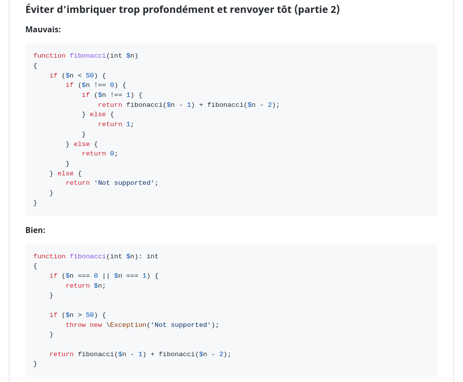
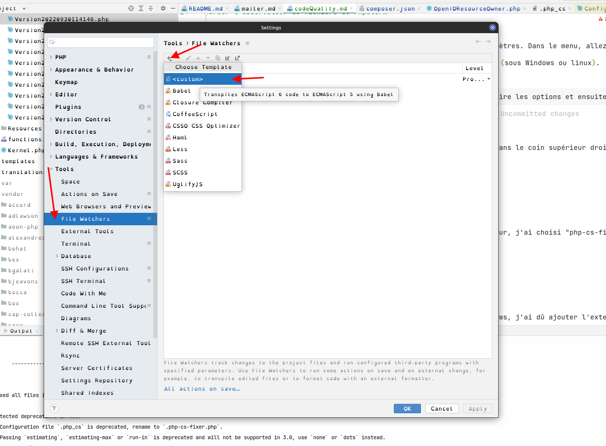
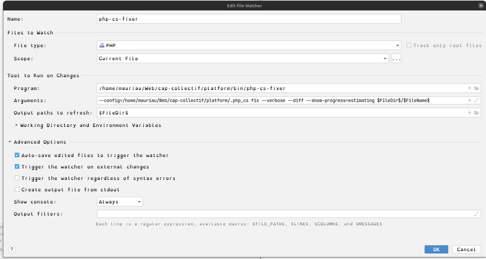

# 

 🇫🇷 Qualité de code

[⬅️](../README.md) Retour

### Sommaire :
1. [Standards de code](#standard)
2. [CLEAN CODE](#cleanCode)
3. [CS-FIXER](#csfixer)
4. [Créer le FileWatcher sous PhpStorm](#filewatcher)
5. [Config VisualStudio](https://blog.theodo.com/2019/07/vscode-php-development/)

1 Standard de code

---

La partie backend utile PHP et Symfony, nous utilisons donc les normes [PSR](https://www.php-fig.org/psr/psr-12/) et [Symfony](https://symfony.com/doc/current/contributing/code/standards.html).

2 Clean Code

---
De plus, nous recommandons très fortement d'utiliser au mieux les principes de [clean code](https://github.com/errorname/clean-code-php), notamment pour faciliter la lecture et compréhension du code. Voici un aperçu. 

3 CS FIXER

---

Si vous avez déjà installé le projet, il embarque un système de précommit qui reformat le code via [CS-FIXER](https://github.com/PHP-CS-Fixer/PHP-CS-Fixer). Si le précommit prend trop de temps pour les autres tests de règles et que vous avez la fâcheuse tendance à faire des `commit -n`, n'hésitez pas à installer _cs-fixer_ sur votre IDE. Ça formatera le code à la sauvegarde.

* [Atom](https://github.com/Glavin001/atom-beautify)
* [NetBeans](https://plugins.netbeans.apache.org/catalogue/?id=36)
* [PhpStorm](https://www.jetbrains.com/help/phpstorm/using-php-cs-fixer.html)
* [Sublime Text](https://github.com/benmatselby/sublime-phpcs)
* [Vim](https://github.com/stephpy/vim-php-cs-fixer)
* [VS Code](https://github.com/junstyle/vscode-php-cs-fixer)

Pour PHPStorm, il est possible d'ajouter une fileWatcher pour formater le code à la sauvegarde
https://eidson.info/post/phpstorm-file-watcher-php-cs-fixer

4 Créer le FileWatcher sous PhpStorm

---
Depuis l'intérieur d'un projet dans PhpStorm, ouvrez la page des paramètres. Dans le menu, allez à `Fichier > Paramètres` ou utilisez le raccourci clavier `ctrl+alt+s` (sous Windows ou linux).

A partir de là, vous pouvez commencer à taper 'file watcher' pour réduire les options et ensuite sélectionner File Watchers sous l'onglet Tools.

Ensuite, appuyez sur alt + insert ou sur l'icône verte du signe plus dans le coin supérieur droit pour créer un nouvel observateur de fichiers.

Choisissez l'option Modèle personnalisée.

Dans la boîte de dialogue qui s'ouvre, donnez un nom à votre observateur, j'ai choisi "php-cs-fixer", pour des raisons de simplicité.

Définissez le type de fichier à "PHP" et la portée à "Current File".

Définissez le programme à "php-cs-fixer". 

En argument j'ai mis le chemin du fichier de config en absolut
`--config=/home/mauriau/Web/cap-collectif/platform/.php_cs fix --verbose --diff --show-progress=estimating $FileDir$/$FileName$`, avec `Current File` pour scope

Il est possible de faire la même chose avec [prettier](https://medium.com/@dyanagi/format-with-prettier-on-save-in-intellij-based-ides-webstorm-451e0c69bab1)

