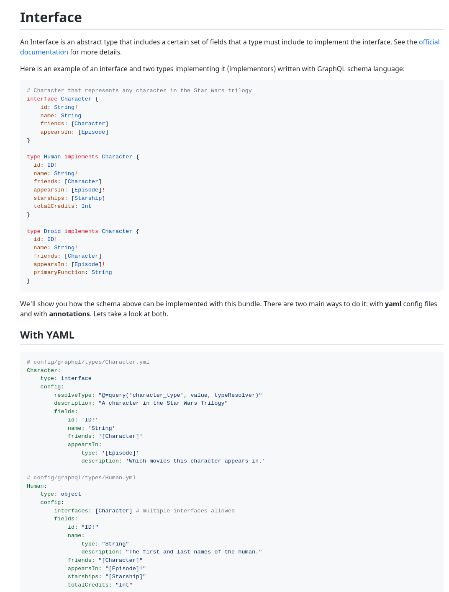
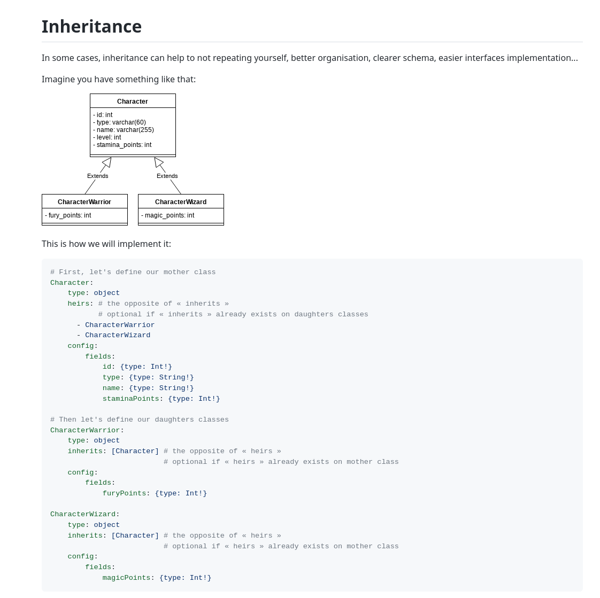

<!-- @format -->

🇫🇷 <a id="GraphQL"></a> GraphQL
=======

[⬅️](../README.md) Retour

Nous utilisons le bundle d'[Overblog](https://github.com/overblog/GraphQLBundle). On va souvent la citer, donc vous pouvez déjà l'explorer

#### Sommaire :
01. [Management des fichiers](#files)
02. [Déclarer une mutation](#mutation)
03. [Gestion des erreurs](#errorCode)
04. [Les Interfaces](#interfaces)
05. [L'héritage](#inherit)
06. [Type de donnée](#data)
07. [Les globalID](#globalID)
08. [Les connections](#connection)
09. [Les queries](#query)
10. [GraphiQL](#graphiql)
11. [Les commandes](#commandes)


###  <div id="files"/></div> Management des fichiers [⬆️](#GraphQL)

Dans `src/Capco/AppBundle/Resources/config/GraphQL/internal`, les fichiers sont organisés de deux façons.

❌ La première legacy, fut de tout mettre dans des dossiers en fonction du type de fichier et nommer les fichiers en fonction de la feature
```
    config
        |- GraphQL
          |- internal
            | - enum
            | - mutation
                |- mutation.types.yaml
                |- Organization
                    |- mutation.types.yaml
            | - object
                |- Organization
            | - relay-connection
```

✅ La seconde est d'organiser directement par feature, puis par type de fichier. Cf. le dossier ["Organization"](../src/Capco/AppBundle/Resources/config/GraphQL/internal/Organization)

```
    config
       |- GraphQL
          |- internal
            |- Organization
                | - enum
                    |- enum.types.yaml
                | - mutations
                    |- mutation.types.yaml
                | - object
                    |- object.types.yaml
                | - relay-connection
                    |- connection.types.yaml
```
C'est toujours en cours de migration, donc si c'est une nouvelle feature créer le dossier, sinon, continuer avec le legacy

###  <div id="mutation"/></div>Déclarer une mutation [⬆️](#GraphQL)

➡️ [Doc Overblog](https://github.com/overblog/GraphQLBundle/blob/master/docs/definitions/mutation.md)

Une mutation côté backend se fait en x temps

- Les fichiers Input et Payload

    Dans `internal/featureName/mutations/`

    Ici, ajouter vos fichiers `XInput.types.yaml` et, `XPayload.types.yaml`

Exemple :
`AddOrganizationInput.types.yaml`
```yaml
AddOrganizationInput:
    type: relay-mutation-input
    config:
        description: 'Input type of AddOrganization'
        fields:
            translations:
                type: '[InternalUpdateOrganizationTranslationInput!]'
```
`AddOrganizationPayload.types.yaml`
```yaml
AddOrganizationPayload:
    type: relay-mutation-payload
    config:
        fields:
            organization:
                type: 'InternalOrganization'
                description: 'The newly created organization.'

```
- Le fichier de mutation en PHP
Dans  `src/Capco/AppBundle/GraphQL/Mutation/FeatureName`, ajoutez votre fichier de mutation
[Exemple](../src/Capco/AppBundle/GraphQL/Mutation/Organization/AddOrganizationMutation.php) : 
```php
    <?php
    
    namespace Capco\AppBundle\GraphQL\Mutation\Organization;
    
    use Capco\AppBundle\Entity\Organization\Organization;
    use Capco\AppBundle\Form\OrganizationType;
    use Capco\AppBundle\GraphQL\Exceptions\GraphQLException;
    use Capco\AppBundle\GraphQL\Mutation\Locale\LocaleUtils;
    use Doctrine\DBAL\Exception\DriverException;
    use Doctrine\ORM\EntityManagerInterface;
    use Overblog\GraphQLBundle\Definition\Argument as Arg;
    use Overblog\GraphQLBundle\Definition\Resolver\MutationInterface;
    use Overblog\GraphQLBundle\Error\UserError;
    use Symfony\Component\Form\FormFactoryInterface;
    
    class AddOrganizationMutation implements MutationInterface
    {
        private EntityManagerInterface $em;
        private FormFactoryInterface $formFactory;
    
        public function __construct(EntityManagerInterface $em, FormFactoryInterface $formFactory)
        {
            $this->em = $em;
            $this->formFactory = $formFactory;
        }
    
        public function __invoke(Arg $input): array
        {
            $data = $input->getArrayCopy();
            LocaleUtils::indexTranslations($data);
    
            $organization = new Organization();
            $organization->mergeNewTranslations();
    
            $form = $this->formFactory->create(OrganizationType::class, $organization);
            $form->submit($data, false);
            if (!$form->isValid()) {
                throw GraphQLException::fromFormErrors($form);
            }
    
            try {
                $this->em->persist($organization);
                $this->em->flush();
            } catch (DriverException $e) {
                throw new UserError($e->getMessage());
            }
    
            return ['organization' => $organization];
        }
    }
```

- Déclaration dans le fichier de mutation

Dans le fichier `src/Capco/AppBundle/Resources/config/GraphQL/internal/InternalMutation.types.yaml`, déclarez votre mutation à la suite
Exemple : 
```yaml
            addOrganization: #nom de la mutation
                access: "@=hasRole('ROLE_ADMIN')" 
                builder: 'Relay::Mutation'
                builderConfig:
                    inputType: AddOrganizationInput
                    payloadType: AddOrganizationPayload
                    mutateAndGetPayload: '@=mutation("Capco\\AppBundle\\GraphQL\\Mutation\\Organization\\AddOrganizationMutation", [value])'
```

_access_ peut prendre soit un role, soit un fonction
`access: '@=service("Capco\\AppBundle\\GraphQL\\Mutation\\DeleteCommentMutation").isGranted(args["input"]["id"], getUser())'`

`mutateAndGetPayload` peut prendre plusieurs paramètres en plus du fichier PHP comme `[value, getUser()]`

###  <div id="errorCode"/></div>Gestion des erreurs [⬆️](#GraphQL)

Lors de votre mutation ou query, il peut y avoir des cas d'erreur à gérer. Le plus courant étant une erreur 404. Pour cela, on a besoin de déclarer les types d'erreurs sous forme de constante dans des fichiers dédiés (un enum) puis dans le payload.

[Exemple](src/Capco/AppBundle/Resources/config/GraphQL/internal/Organization/enum/DeleteOrganizationInvitationErrorCode.types.yaml) :
```yaml
DeleteOrganizationInvitationErrorCode:
    type: enum
    config:
        name: DeleteOrganizationInvitationErrorCode
        description: 'Available errors for an `deleteOrganizationInvitionInput` mutation.'
        values:
            INVITATION_NOT_FOUND:
                value: '@=constant("Capco\\AppBundle\\GraphQL\\Mutation\\Organization\\DeleteOrganizationInvitationMutation::INVITATION_NOT_FOUND")'
                description: 'The invitation for the given ID is not found.'
            ERROR_X:
              value: '@=constant("Capco\\AppBundle\\GraphQL\\Mutation\\Organization\\DeleteOrganizationInvitationMutation::ERROR_X")'
              description: 'The error X.'
            #...
```

Puis dans le Payload de la mutation
```yaml
DeleteOrganizationInvitationPayload:
  type: relay-mutation-payload
  config:
    name: DeleteOrganizationInvitationPayload
    description: 'Payload of deleteOrganizationInvitation mutation.'
    fields:
      invitationId:
        type: 'ID'
        description: 'The deleted invitation id.'
      errorCode: #ici on déclare le champ retourné errorCode
        type: 'DeleteOrganizationInvitationErrorCode' #il est du type que l'on vient de déclarer
        description: 'The available errors for deleteOrganizationInvitation mutation.'
```

###  <div id="interfaces"/></div>Les interfaces [⬆️](#GraphQL)

➡️ [Doc Overblog](https://github.com/overblog/GraphQLBundle/blob/master/docs/definitions/type-system/interface.md)
La gestion, des interfaces est déjà expliquée dans la doc d'Overblgog

En voici un aperçu :



###  <div id="inherit"/></div>L'héritage [⬆️](#GraphQL)

➡️ [Doc Overblog](https://github.com/overblog/GraphQLBundle/blob/master/docs/definitions/type-inheritance.md)

La gestion, de l'héritage est déjà expliqué dans la doc d'overblgog

En voici un aperçu :




###  <div id="data"/></div>Type de donnée [⬆️](#GraphQL)

➡️ [Doc Overblog](https://github.com/overblog/GraphQLBundle/blob/master/docs/definitions/type-system/scalars.md)

En plus des types donnés par Overblog, nous avons nos types personnalisés dans [src/Capco/AppBundle/Resources/config/GraphQL/public/custom-scalar](../src/Capco/AppBundle/Resources/config/GraphQL/public/custom-scalar). Comme URI pour déclarer une URL, HTML utilisé principalement pour du contenu comme dans le champ _body_, DateTime pour gérer les dates etc.

###  <div id="globalID"/></div>Les globalID [⬆️](#GraphQL)

➡️ [Doc Overblog](https://github.com/overblog/GraphQLBundle/blob/master/docs/definitions/relay/node/global-id.md)

Pour GraphQL, nous avons choisi d'utiliser des globalID pour gérer les ID. Le global ID est une encapsulation de l'UUID + le type de donnée, le tout encodé en [base64](https://www.base64encode.org/).

Sous cette forme `type:ID` : 
```
User:userToto
```
Donne
`VXNlcjp1c2VyVG90bw==`

Pour utiliser les globalID sur une entité, il faut le déclarer :

Dans l'objet yaml
```yaml
    Comment:
      type: object
      #[...]
      config:
        fields:
            id:
                builder: 'Relay::GlobalId'
                builderConfig:
                    typeName: Comment
```

Et dans le [GlobalIdResolver](../src/Capco/AppBundle/GraphQL/Resolver/GlobalIdResolver.php)

```php
    public function resolve(string $uuidOrGlobalId, $userOrAnon, ?\ArrayObject $context = null)
    {
        //...
        switch ($decodeGlobalId['type']) {
          case 'Comment':
              $node = $this->container->get(CommentRepository::class)->find($uuid);
  
              break;
```

Quelques fonctions utiles :

Pour transformer un id en globalId depuis twig, il y a la twig Extension [GlobalIdExtension](../src/Capco/AppBundle/Twig/GlobalIdExtension.php). Ça peut être utile pour passer des props par [exemple](../src/Capco/AppBundle/Resources/views/Blog/show.html.twig),

```twig
    {{ react_render_component('ProposalNewsHeaderButtonsApp', {
        'props': {
            'postId': post.id|toGlobalId('Post'),
        }
    })}}
```

Dans [GlobalIdResolver.php](../src/Capco/AppBundle/GraphQL/Resolver/GlobalIdResolver.php), la fonction, `getDecodedId` peut être utile pour récupérer l'UUID depuis un globalID.

<u>La fonction _resolve_ du `GlobalIdResolver` permet de trouver directement l'objet en fonction du GlobalID.</u>

###  <div id="connection"/></div>Les Connections [⬆️](#GraphQL)

➡️ [Doc Overblog](https://github.com/overblog/GraphQLBundle/blob/master/docs/definitions/relay/connection.md)

La connection est un pattern pour renvoyer une liste de donnée avec pagination à Relay. Il faut privilégier cette utilisation au renvoi d'un tableau.

Quand par exemple dans votre Résolver ou mutation, vous devez renvoyer une liste d'objet paginer, on utilise le Paginator et pour passer les donnés à GraphQL, il faut créer une connection.

```yaml
  PendingOrganizationInvitationConnection:
      type: relay-connection
      config:
          nodeType: 'InternalPendingOrganizationInvitation!' #type d'objet renvoyé
          connectionFields:
              totalCount: #ajout du champ totalCount
                  type: Int!
```

Puis, dans [l'objet](../src/Capco/AppBundle/Resources/config/GraphQL/internal/Organization/objects/InternalOrganization.types.yaml)

```yaml
      InternalOrganization:
        type: object
        fields:
            pendingOrganizationInvitations:
                access: '@=resolver("Capco\\AppBundle\\GraphQL\\Resolver\\Organization\\OrganizationAdminAccessResolver", [value, getUser()])'
                type: 'PendingOrganizationInvitationConnection' #ici le type connection
                description: 'Get all pending invitations.'
                argsBuilder: 'Relay::ForwardConnection' #l'args builder pour la pagination et autres filtres
                resolve: '@=resolver("Capco\\AppBundle\\GraphQL\\Resolver\\Organization\\PendingOrganizationInvitationsResolver", [value, args])'
```

Ou dans le Payload

```yaml
InternalAddProposalsFromCsvPayload:
    type: relay-mutation-payload
    fieds:
        importedProposals:
            type: 'InternalProposalConnection'
            description: 'List of imported proposals.'
```

###  <div id="query"/></div>Les queries [⬆️](#GraphQL)

➡️ [Doc Overblog](https://github.com/overblog/GraphQLBundle/blob/master/docs/definitions/relay/connection.md)

Pour récupérer des données, par exemple, l'utilisateur courant, on passe par le fichier [InternalQuery](../src/Capco/AppBundle/Resources/config/GraphQL/internal/InternalQuery.types.yaml) où on créer les champs que l'on souhaite, associé à leur résolver

```yaml
InternalQuery:
    type: object
    config:
        name: Query
        description: 'Root of the schema.'
        fields:
          viewer:
            access: "@=hasRole('ROLE_USER')"
            type: 'InternalUser!'
            description: 'The currently authenticated user.'
            resolve: '@=getUser()'
```

Qui part la suite permettent d'être requêtée en front ou sur GraphiQL.

###  <div id="graphiql"/></div>GraphiQL [⬆️](#GraphQL)

➡️ [Doc](https://github.com/GraphQL/graphiql)

GraphiQL est une interface web pour tester les requêtes GraphQL. C'est disponible en développement sur https://capco.dev/graphiql/internal

Exemple de mutation

```GraphQL
mutation {
  register(input: {email: "hjggjh", username: "titi", plainPassword: "titi418!qsd", responses: [{question: "UXVlc3Rpb246Ng==", value: "Réponse à la question obligatoire"}, {question: "UXVlc3Rpb246MTc=", value: "Sangohan"}]}) {
    user {
      organizations {
        id
        title
      }
    }
  }
}
```

Exemple de query

```GraphQL
{
    node(id: "T3JnYW5pemF0aW9uOm9yZ2FuaXphdGlvbjE=") {
      ... on Organization {
        id
        title
        body
      }
  }
}
```

### <div id="commandes"/></div>Les commandes [⬆️](#GraphQL)

Voici quelques commandes à connaitre 

- Tout rebuild front et back `yarn relay`
- Rebuild que la partie front. Comme quand on modifie la requête `yarn run build-relay-schema`

