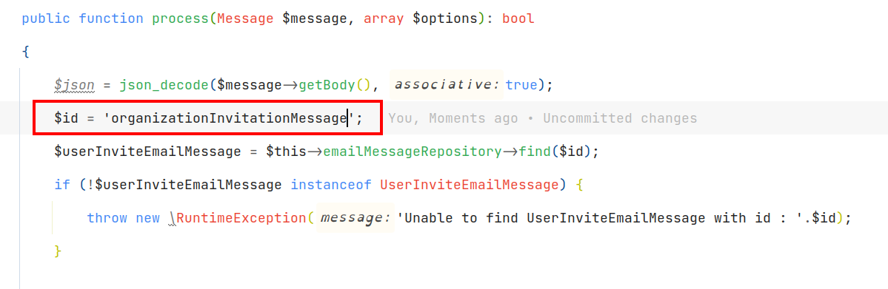
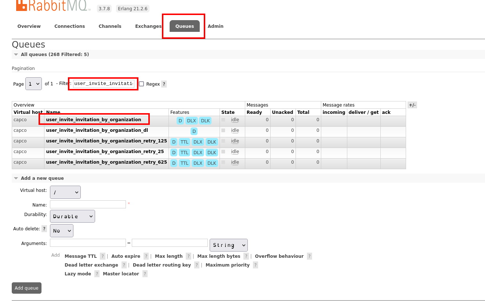
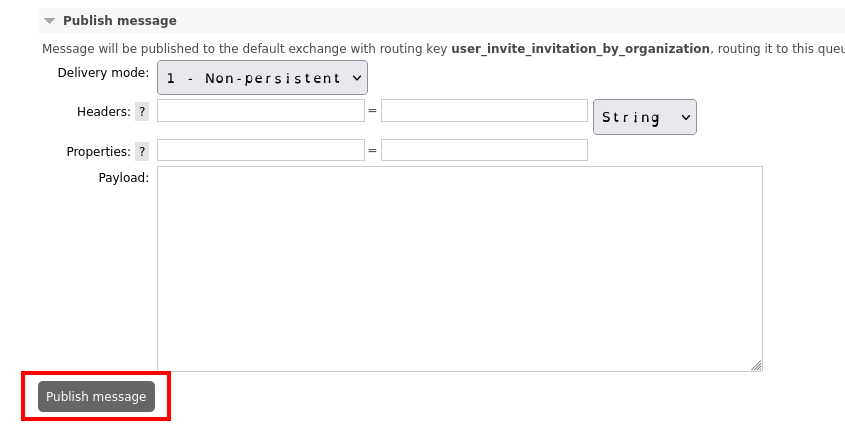
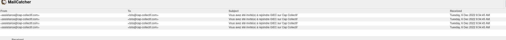

# <a id="mailer"></a>  🇫🇷 Ajout d'emailing

[⬅️ Retour](../README.md) 

Si vous voulez envoyer des emails via la plateforme, cela se fait via RabbitMQ.

#### Sommaire :
- 1 [La Config](#config)
- 2 [Le Processor](#processor)
- 3 [Le Notifier](#notifier)
- 4 [Le Message](#message)
- 5 [Le Supervisor](#supervisor)
- 6 [Trigger l'envoi d'email local](#local) 
- 7 [Les tests e2e](#test)

###  <div id="config"/></div> La config [⬆️](#mailer) 

Dans votre fichier initiale, utilisez le publisher de RabbitMQ

exemple :

```php
$this->publisher->publish(
    CapcoAppBundleMessagesTypes::MY_WORKER,
    new Message(
        json_encode([
            'id' => $entity->getId(),
        ])
    )
);

```

Pour créer le worker :

Décalez-le dans config/rabbitmq.yaml et config/packages/swarrot.yaml

`config/rabbitmq.yaml`

```yaml
my_worker:
  durable: true
  retries: [ 25, 125, 625 ]
  bindings:
    - exchange: capco_direct_exchange
      routing_key: my_worker
```

`config/packages/swarrot.yaml`

```yaml
messages_types:
    my.worker:
          exchange: capco_direct_exchange
          routing_key: my_worker
```

Puis, dans le même fichier plus bas

```yaml

consumers:
  my_worker:
    processor: Capco\AppBundle\Processor\MyProcessor
    middleware_stack:
      - configurator: swarrot.processor.signal_handler
      - configurator: swarrot.processor.max_execution_time
        extras:
          max_execution_time: 100
      - configurator: swarrot.processor.max_messages
      - configurator: swarrot.processor.doctrine_connection
      - configurator: swarrot.processor.doctrine_object_manager
      - configurator: swarrot.processor.ack
      - configurator: swarrot.processor.retry
        extras:
          retry_attempts: 3
          retry_exchange: 'retry'
          retry_routing_key_pattern: 'my_worker_retry_%%attempt%%'


```

Dans `src/Capco/AppBundle/CapcoAppBundleMessagesTypes.php`, ajouter votre worker à la liste

###  <div id="processor"/></div> Le Processor [⬆️](#mailer) 

Il doit ressembler à ça :

```php
<?php

namespace Capco\AppBundle\Processor;

use Capco\AppBundle\Notifier\MyNotifier;

use Swarrot\Broker\Message;
use Swarrot\Processor\ProcessorInterface;

class MyProcessor implements ProcessorInterface
{
    private $repository;
    private $notifier;

    public function __construct(MyRepository $repository, MyNotifier $notifier)
    {
        $this->repository = $repository;
        $this->notifier = $notifier;
    }

    public function process(Message $message, array $objects): bool
    {
        $json = json_decode($message->getBody(), true);
        $id = $json['id'];
        $object = $this->repository->find($id);
        if (!$object) {
            throw new \RuntimeException('Unable to find object with id : ' . $id);
        }

        $this->notifier->onCreate($object);

        return true;
    }
}

```

###  <div id="notifier"/></div> Le notifier [⬆️](#mailer) 

```php

<?php

namespace Capco\AppBundle\Notifier;

use Capco\AppBundle\Entity\MyEntity;
use Capco\AppBundle\GraphQL\Resolver\Opinion\OpinionUrlResolver;
use Capco\AppBundle\Mailer\MailerService;
use Capco\AppBundle\Mailer\Message\MyMessage;
use Capco\AppBundle\Resolver\LocaleResolver;
use Capco\AppBundle\SiteParameter\SiteParameterResolver;
use Symfony\Component\Routing\RouterInterface;

class MyNotifier extends BaseNotifier
{

    public function __construct(
        MailerService $mailer,
        SiteParameterResolver $siteParams,
        RouterInterface $router,
        LocaleResolver $localeResolver
    ) {
        parent::__construct($mailer, $siteParams, $router, $localeResolver);
    }

    public function onCreate(MyObject $myObject)
    {
            //do Something
            $this->mailer->createAndSendMessage(MyMessage::class, $myObject, [...myParams]);    
    }

}
```

###  <div id="message"/></div> Le Message [⬆️](#mailer)

Dans `src/Capco/AppBundle/Mailer/Message/MyMessage.php`
Ça peut étendre abstract message ou moderable message suivant le type de message

```php

<?php

namespace Capco\AppBundle\Mailer\Message;

use Capco\AppBundle\Mailer\Message\AbstractMessage;
~~~~
final class MyMessage extends AbstractMessage
{
    public const SUBJECT = 'trad-key';
    public const TEMPLATE = 'CapcoMail/template/path.twig';
    public const FOOTER = ''; //laisser vide

    public static function getMyTemplateVars(ModerableInterface $moderable, array $params): array
    {
        // do Something
        return [
          ...myParamsToPutInsideEmail
        ];
    }
    
    public static function getMySubjectVars(ModerableInterface $moderable, array $params): array
    {
    // do Something
        return [
          ...myParams
        ];
    }
}

```

### <div id="supervisor"/></div> Le supervisor [⬆️](#mailer)

Il faut référencer le worker dans le supervisor de prod

dans `infrastructure/services/remote/supervisord/featureName.conf`

```editorconfig
[program:my_worker]
command=sh -c "php bin/console swarrot:consume:my_worker my_worker --env=prod || (sleep 60s && false)"

directory=/var/www
autostart=true
autorestart=true
user=capco
startsecs=0
stdout_logfile=/dev/stdout
stderr_logfile=/dev/stderr
stdout_logfile_maxbytes = 0
stderr_logfile_maxbytes = 0

```

###  <div id="local"/></div> Trigger l'envoi d'email en local [⬆️](#mailer)

Parfois, on n'a juste pas besoin de lancer les tests e2e ou de faire tout le processus via l'UI pour déclencher l'envoie d'email. Pour ça il existe une méthode manuelle :

Dans votre Processor faker les IDs en dure dont vous avez besoin. 

Puis aller sur https://rabbitmq.cap.co/ (login guest, mdp :guest) dans l'onglet "Queues", recherchez/cliquez sur votre worker en question.
 
Et publiez un message, ensuite lancez votre commande de consumer normalement.
Dans l'exemple : `bin/console swarrot:consume:user_invite_invitation_by_organization user_invite_invitation_by_organization
`
vous devriez avoir trigger l'envoi d'email en question, il se retrouve sur l'URL mail.cap.co



###  <div id="test"/></div> Les tests e2e [⬆️](#mailer)

On utilise les tests e2e pour avoir un snapshot d'email et donc déceler les éventuelles régressions. Mais on peut aussi tester le résultat comme le nombre d'emails envoyés, le titre du sujet etc.

Pour ajouter un test e2e, ça se passe dans `features/commands/consumers`
Exemple :


```gherkin

@database @rabbitmq @snapshot-email @dev
Scenario: A user invitation is asynchronous
Given I publish in "user_invite_invitation_by_organization" with message below:
"""
  {
    "id": "organizationInvitationMessage"
  }
  """
And I consume 1 messages in "user_invite_invitation_by_organization"
And I open mail with subject "notification-subject-organization-invite"
Then email should match snapshot 'userOrganizationInvitation.html'
```

Dans le container de l'application Docker vous pouvez jouer cette commande pour générer le snapshot
`UPDATE_SNAPSHOTS=true php -d memory_limit=-1 ./bin/behat -p commands --tags=dev`