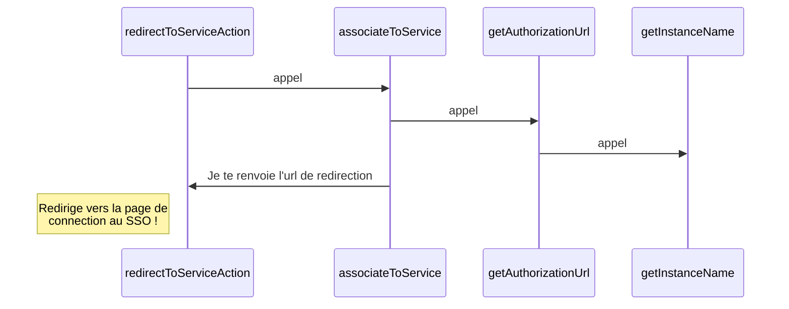
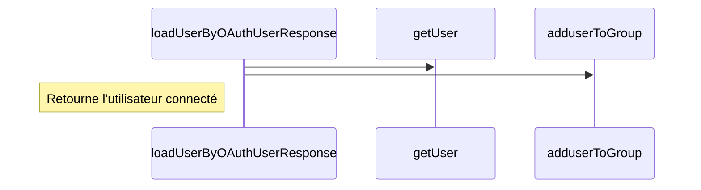
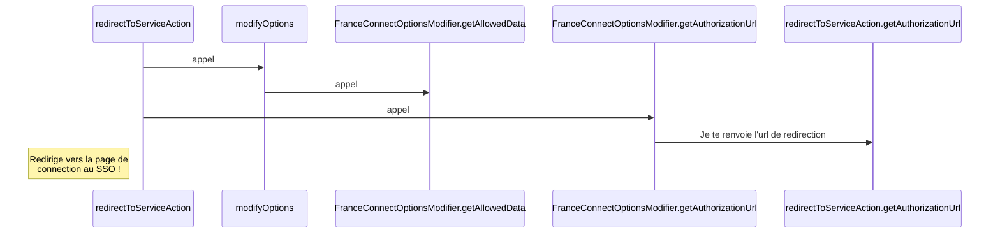
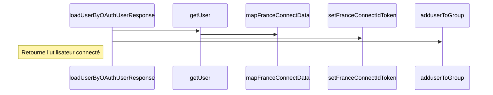

Le fonctionnement des SSOs
===
[⬅️ Retour](../README.md)

Notes :
On ne peut pas avoir plusieurs SSOs d'activé, ça pose un problème de déconnexion. Le cas n'arrivant pas chez les clients, on a pas développé cette partie.

Un petit outil pratique : [jwt.io](https://jwt.io/)

OpenID
---
<!-- you need to install mermaid on your IDE -->

Au clique sur le bouton se connecter

A la connection depuis le SSO OpenID

FranceConnect
---

- Cadrage du projet : https://partenaires.franceconnect.gouv.fr/monprojet/cadrage
- La doc https://partenaires.franceconnect.gouv.fr/fcp/fournisseur-service

Au clique sur le bouton se connecter

A la connection depuis le SSO FranceConnect

